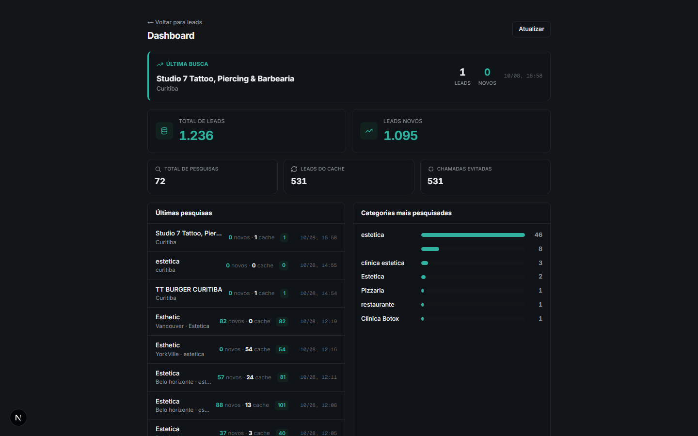
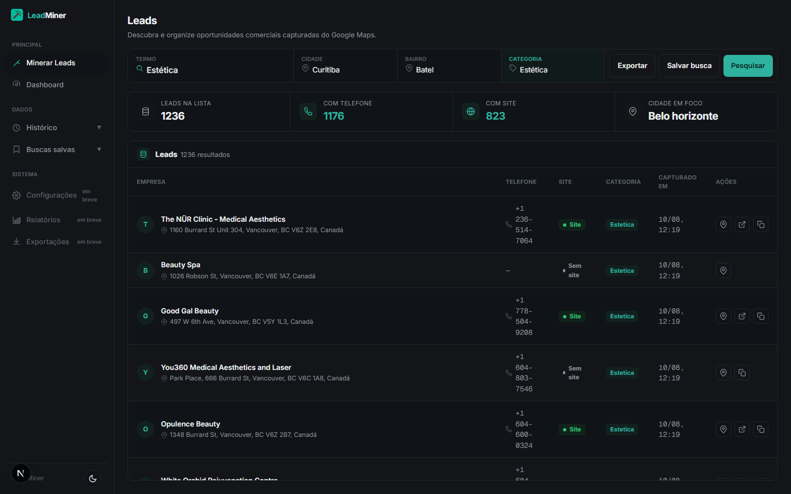
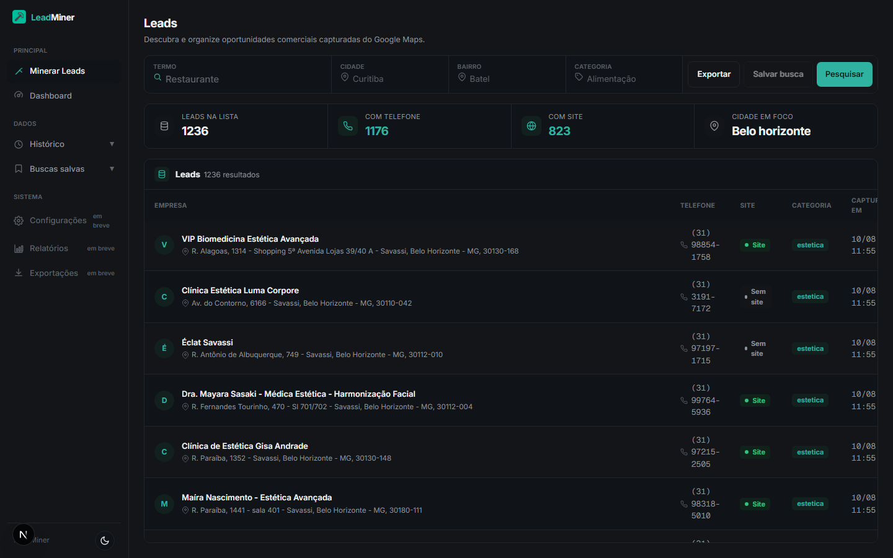
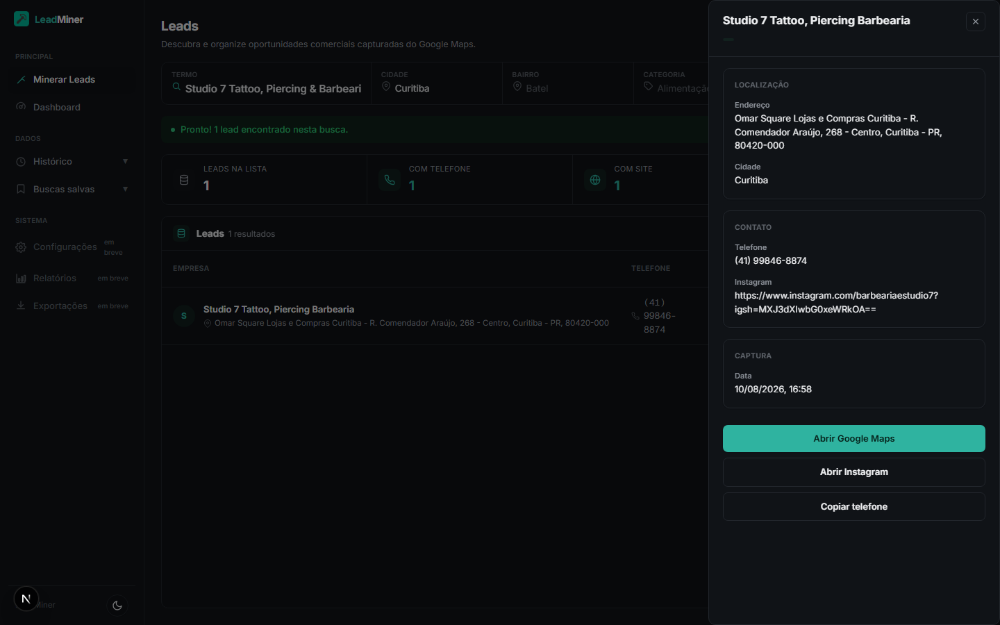
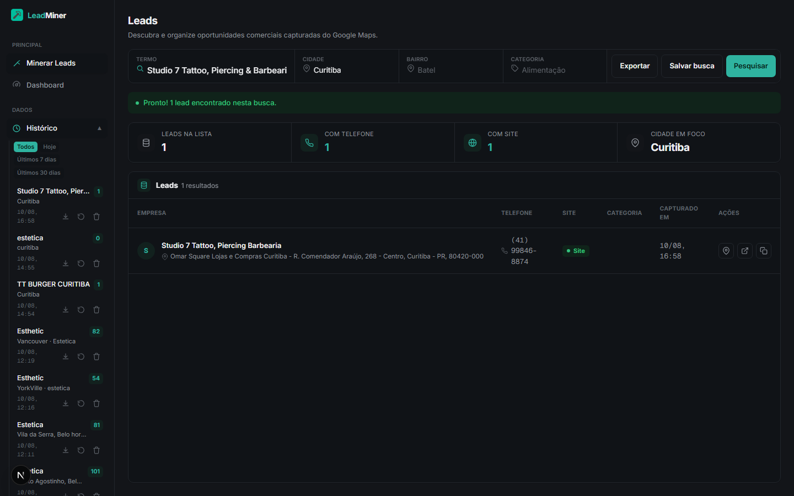
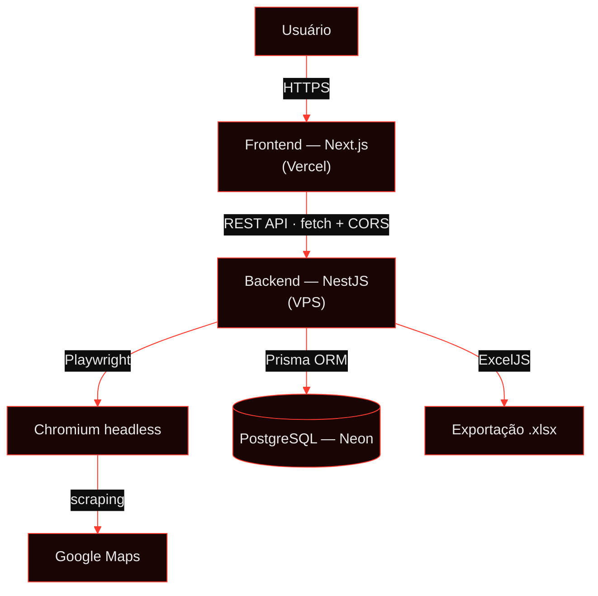

<div align="center">


<sub><code>daks-2k25@github:~$ cd MinerLeads-V1 && cat README.md</code></sub>


### Prospecção de leads B2B a partir do Google Maps.
Busca, organiza, enriquece e exporta oportunidades comerciais reais — sem depender de uma API paga.


<a href="https://github.com/daks-2k25/MinerLeads-V1"></a>

**[`Sobre`](#sobre-o-projeto) · [`Funcionalidades`](#funcionalidades) · [`Screenshots`](#screenshots) · [`Arquitetura`](#arquitetura) · [`Stack`](#tech-stack) · [`Como funciona`](#como-funciona) · [`Instalação`](#instalação-local) · [`Deploy`](#deploy) · [`Roadmap`](#roadmap)**

</div>


## Sobre o projeto
<sub><code>$ cat about.md</code></sub>

**LeadMiner** é uma plataforma de prospecção comercial que captura leads B2B reais a partir de dados públicos do Google Maps. Em vez de depender de uma API paga (Google Places), o backend automatiza um navegador (Playwright + Chromium) para buscar empresas por termo, cidade, bairro e categoria, extrair nome, telefone, site/rede social e endereço, e organizar tudo numa lista pronta para prospecção.

**Para quem é**: times comerciais, agências e profissionais de vendas B2B que precisam montar listas de prospecção segmentadas por localização e nicho, sem pagar por uma API de dados comerciais.

**Problema que resolve**: montar uma lista de leads qualificados manualmente (empresa por empresa, aba por aba do Google Maps) é lento e repetitivo. O LeadMiner faz essa coleta de forma automatizada, evita recapturar a mesma empresa duas vezes (cache por identificador único) e entrega os dados prontos para exportação.

**Como funciona, em uma frase**: o usuário define os filtros de busca no frontend, o backend controla um Chromium headless que navega e coleta os resultados do Google Maps, os dados são persistidos num banco Postgres e ficam disponíveis na interface — com histórico, buscas salvas e exportação para Excel.


## Funcionalidades
<sub><code>$ ls -la features/</code></sub>

Cada item abaixo foi confirmado diretamente no código — nada listado aqui é aspiracional.

| | |
|---|---|
| 🔎 **Busca de leads** | Busca empresas no Google Maps por termo, cidade, bairro e categoria, com scraping automatizado (Playwright). |
| 🧠 **Deduplicação & cache** | Cada empresa é identificada por um `placeId` único; empresas já capturadas antes são reconhecidas como cache em vez de reprocessadas do zero. |
| 📊 **Dashboard** | Métricas agregadas: total de leads, leads novos, total de pesquisas, leads reaproveitados do cache. |
| 📋 **Histórico de buscas** | Lista as buscas já realizadas, com opção de repetir os mesmos filtros ou exportar os leads daquela busca específica. |
| ⭐ **Buscas salvas** | Salva uma combinação de filtros (termo, cidade, bairro, categoria) para reexecutar depois com um clique. |
| 📥 **Exportação para Excel** | Gera uma planilha `.xlsx` formatada (cabeçalho, autofiltro, largura de coluna automática) com os leads da lista atual. |
| ⏹️ **Cancelamento de busca** | Uma busca em andamento pode ser cancelada sem perder os leads já capturados até aquele ponto. |
| 📱 **Instagram / Facebook** | Quando o "site" cadastrado da empresa no Maps é um perfil social, o link real do perfil é capturado — não apenas o rótulo genérico. |
| 🌓 **Dark / Light mode** | Tema persistente (localStorage), sem flash do tema errado no carregamento. |
| ⚡ **Tabela virtualizada** | A lista de leads renderiza apenas as linhas visíveis, mantendo performance com centenas de resultados na tela. |
| 🔐 **Autenticação** | 🚧 Estrutura pronta (JWT + Passport, guard e DTOs implementados), mas login **ainda não está ativo** — hoje a API não exige autenticação. |


## Screenshots
<sub><code>$ ls screenshots/</code></sub>

Capturas reais da aplicação rodando localmente, com dados reais já processados pelo scraper (tema escuro).

<div align="center">

**Dashboard** — métricas agregadas de leads, pesquisas e cache


<br/><br/>

**Busca de leads** — filtros por termo, cidade, bairro e categoria


<br/><br/>

**Listagem de leads** — resultados reais capturados do Google Maps


<br/><br/>

**Detalhes do lead** — inclui o link real de Instagram capturado, não apenas o rótulo


<br/><br/>

**Histórico de buscas** — buscas anteriores, com filtro por período


</div>

<sub>Outras telas (modal de busca salva, tema claro) ficam para uma próxima atualização.</sub>


## Arquitetura
<sub><code>$ ./architecture.sh</code></sub>



- **Frontend** (`leadminer-frontend`): Next.js (App Router) + TypeScript + Tailwind. Consome a API do backend via `fetch`, sem rotas de API próprias — toda a lógica de negócio vive no backend.
- **Backend** (`leadminer-backend`): NestJS, organizado em módulos de domínio (`scraper`, `leads`, `dashboard`, `search-history`, `saved-searches`, `export`, `auth`), cada um com `controller` + `service` + `dto`.
- **Scraper**: módulo dedicado dentro do backend, usa `playwright-core` para controlar um Chromium headless que navega no Google Maps, coleta a lista de resultados e extrai os dados de cada empresa.
- **Banco**: PostgreSQL hospedado no Neon, acessado via Prisma (com adapter de conexão via pooler em runtime e conexão direta para migrations).
- **Autenticação**: módulo `auth` com JWT/Passport já estruturado (guard, decorator `@Public()`, DTOs), mas **não é aplicado globalmente ainda** — todos os endpoints estão acessíveis sem login nesta fase da V1.
- **Comunicação entre serviços**: só há dois serviços (frontend e backend); a comunicação é HTTP/REST simples, liberada por uma allowlist de origens via `CORS_ORIGIN`. Não há fila, mensageria ou processamento assíncrono em background — a busca é uma requisição síncrona que só responde quando o scraping termina.


## Tech Stack
<sub><code>$ ls tech-stack/</code></sub>

### 🔴 Frontend
| Tecnologia | Uso |
|---|---|
|  | Framework React (App Router), build e roteamento |
|  | Interface |
|  | Tipagem estática |
|  | Estilização, tema dark/light via CSS variables |

### 🔴 Backend
| Tecnologia | Uso |
|---|---|
|  | Framework da API (sobre Express) |
|  | Tipagem estática |
| `class-validator` / `class-transformer` | Validação de DTOs de entrada |
| Passport + JWT | Estrutura de autenticação (pronta, não ativa) |

### 🔴 Database
| Tecnologia | Uso |
|---|---|
|  | Banco relacional, hospedado no [Neon](https://neon.tech) |
|  | ORM, migrations e client tipado |

### 🔴 Scraping
| Tecnologia | Uso |
|---|---|
|  | Automação de navegador (`playwright-core`) |
| Chromium | Navegador headless controlado pelo scraper |

### 🔴 Exportação
| Tecnologia | Uso |
|---|---|
| ExcelJS | Geração da planilha `.xlsx` de leads |

### 🔴 Deploy
| Camada | Onde |
|---|---|
| Frontend | Vercel |
| Backend + Scraper | VPS Linux próprio |
| Banco | Neon (PostgreSQL gerenciado) |

### 🔴 Tools
| Ferramenta | Uso |
|---|---|
| ESLint + Prettier | Padronização de código |
| Jest | Testes (estrutura criada no backend) |
| PM2 | Processo contínuo do backend em produção |


## Como funciona
<sub><code>$ ./how-it-works.sh</code></sub>

Fluxo real de uma busca, do clique em "Pesquisar" até o resultado na tela:

1. O usuário preenche os filtros (termo, cidade, bairro, categoria) e clica em **Pesquisar**.
2. O frontend envia a busca para a API (`POST /api/scraper`).
3. O backend abre um contexto de navegador (Chromium via Playwright) e acessa o Google Maps.
4. A lista de resultados é coletada com scroll incremental, até esgotar os resultados ou atingir o limite de segurança.
5. Cada empresa da lista é aberta individualmente para extrair nome, telefone, site (incluindo o link real quando é um perfil de Instagram/Facebook), endereço e categoria — com concorrência limitada e timeout por empresa, para não travar a busca inteira por causa de uma empresa problemática.
6. Empresas já conhecidas (mesmo `placeId` de uma busca anterior) são identificadas via cache, em vez de reprocessadas.
7. Cada lead é persistido no PostgreSQL via Prisma, e a busca inteira é registrada no histórico.
8. Os resultados aparecem na tabela do frontend — prontos para visualizar detalhes, salvar a busca, exportar para Excel ou repetir depois pelo histórico.

Cancelar a busca em qualquer momento interrompe o processamento de novas empresas, mas preserva os leads já capturados até aquele instante.


## Instalação local
<sub><code>$ ./install.sh</code></sub>

### Requisitos

- Node.js 20 ou superior
- npm
- Uma instância PostgreSQL acessível (local ou Neon)

### 1. Clonar o repositório

```bash
git clone https://github.com/daks-2k25/MinerLeads-V1.git
cd MinerLeads-V1
```

### 2. Backend (`leadminer-backend`)

```bash
cd leadminer-backend
npm install

# copie o exemplo e preencha com valores reais (nunca comite o .env)
cp .env.example .env

npx prisma generate
npx prisma migrate deploy   # ou "npx prisma migrate dev" se estiver criando uma migration nova

# baixa o Chromium usado pelo scraper (uma vez só, não a cada execução)
npx playwright-core install chromium

npm run start:dev
```

A API sobe com prefixo `/api` (padrão `http://localhost:3001/api`). Variáveis mínimas exigidas no `.env`: `DATABASE_URL`, `CORS_ORIGIN`, `JWT_SECRET` — a aplicação recusa subir se alguma delas estiver ausente (validação em `src/config/env.validation.ts`).

### 3. Frontend (`leadminer-frontend`)

```bash
cd leadminer-frontend
npm install
npm run dev
```

Abra `http://localhost:3000`. O frontend consome a API via `NEXT_PUBLIC_API_URL` (padrão `http://localhost:3001` se a variável não for definida).

### 4. Testar

```bash
# em cada projeto
npx tsc --noEmit
npm run build
```


## Deploy
<sub><code>$ ./deploy.sh</code></sub>

Arquitetura de produção definida e documentada (checklist completo em [`leadminer-backend/docs/DEPLOY-VPS.md`](leadminer-backend/docs/DEPLOY-VPS.md)):

| Camada | Destino | Status |
|---|---|---|
| Frontend | Vercel | 📌 Pronto para deploy, ainda não publicado |
| Backend + Scraper | VPS Linux (Node + PM2 + proxy reverso) | 📌 Checklist pronto, VPS ainda não provisionado |
| Banco | Neon (PostgreSQL) | ✅ Em uso já em desenvolvimento |

Não há URL pública em produção no momento — a aplicação roda hoje em ambiente local/desenvolvimento. O guia de deploy cobre Chromium no VPS, variáveis de ambiente, proxy reverso com timeout adequado para o scraping síncrono, HTTPS e processo contínuo via PM2.


## Roadmap
<sub><code>$ cat roadmap.md</code></sub>

**✅ Implementado**
- Busca de leads via scraping do Google Maps
- Persistência com deduplicação por `placeId`
- Dashboard de métricas
- Histórico de buscas e buscas salvas
- Exportação para Excel
- Cancelamento de busca em andamento
- Captura de link real de Instagram/Facebook
- Dark/Light mode
- Tabela de leads virtualizada

**🚧 Em desenvolvimento**
- Deploy em produção (Vercel + VPS) — infraestrutura documentada, ainda não publicada
- Ativação da autenticação (estrutura JWT já existe, login ainda não é exigido pela API)

**📌 Futuro**
- Login/autenticação obrigatória nos endpoints
- Alguma proteção mínima da API pública no VPS (ex.: rate limiting)
- Paginação nas listagens (leads, histórico, buscas salvas)
- Cobertura de testes automatizados sobre as regras de negócio principais


<div align="center">

<sub><code>root@leadminer:~$ echo "V1 em desenvolvimento — próximo commit: deploy no VPS"</code></sub>


</div>
