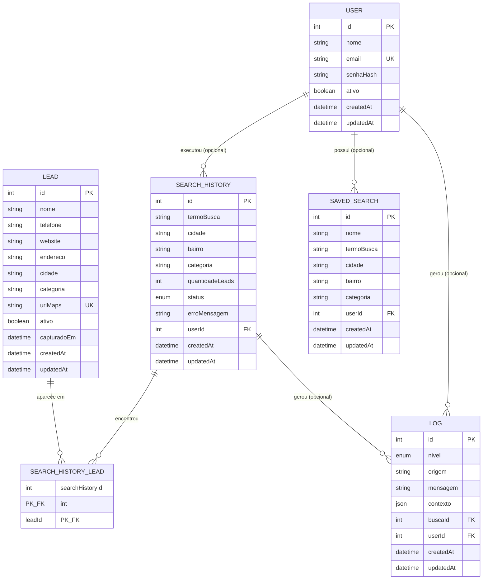

# Database Design — LeadMiner Backend

> Documento de revisão de modelagem para aprovação. **Nenhum `model` foi criado em `prisma/schema.prisma` e nenhuma migration foi gerada.** O objetivo é aprovar entidades, campos, relacionamentos e índices antes de escrever o schema definitivo.

Contexto: [`../../leadminer/docs/MIGRACAO-NESTJS.md`](../../leadminer/docs/MIGRACAO-NESTJS.md) (análise do projeto atual) e a estrutura já criada em `leadminer-backend/src/*` (módulos, controllers, DTOs — sem regra de negócio ainda).

---

## 1. Entidades necessárias

Seis entidades cobrem 100% do que já existe hoje (persistido ou não) no projeto atual, mais a entidade de usuário — incluída desde já porque o LeadMiner terá login/JWT com poucos usuários internos, e o relacionamento (quem criou qual busca, quem salvou qual filtro) precisa existir desde a primeira modelagem, mesmo que o `AuthModule` só ganhe lógica de login depois:

| Entidade | Módulo correspondente | Persiste hoje no SQLite atual? |
|---|---|---|
| `User` | `AuthModule` (estrutura já criada; lógica de login ainda não) | Não existe hoje — entidade nova |
| `Lead` | `LeadsModule` | Não (em memória — ver achado 2.7.1 do doc de migração) |
| `SavedSearch` | `SavedSearchesModule` | Sim (única tabela realmente persistida hoje) |
| `SearchHistory` | `SearchHistoryModule` | Não (em memória) |
| `SearchHistoryLead` (junção) | `SearchHistoryModule` | Não (em memória) |
| `Log` | `LogsModule` | Não (em memória) |

`User` não tem um `UsersModule` dedicado ainda — por ora os campos servem só para modelar o relacionamento; um módulo próprio (ou a inclusão do CRUD de usuário dentro do `AuthModule`) é decisão da etapa em que o login for de fato implementado.

---

## 2. Campos por entidade

Tipos descritos de forma lógica (não é sintaxe Prisma — isso fica para a etapa seguinte, após aprovação).

### 2.1 `Lead`

| Campo | Tipo | Nulo? | Observação |
|---|---|---|---|
| `id` | Int (autoincrement) | não | PK. Mantido como inteiro sequencial (não UUID) — ver seção 7 |
| `nome` | String | sim | Nem toda empresa expõe nome no Maps de forma limpa |
| `telefone` | String | sim | Nem toda empresa lista telefone |
| `website` | String | sim | Nem toda empresa tem site |
| `endereco` | String | sim | |
| `cidade` | String | **não** | Sempre preenchido pelo formulário de busca |
| `categoria` | String | **não** | Idem |
| `urlMaps` | String | **não** | **Único** — é a chave de deduplicação do scraper |
| `ativo` | Boolean | não, default `true` | Novo — permite desativar um lead (ex.: dado incorreto, empresa fechada) sem apagar o histórico de buscas que o encontraram. Mesmo padrão do `User.ativo` |
| `capturadoEm` | DateTime | não | Timestamp de negócio: quando o dado foi extraído do Google Maps. Era `TEXT` ISO-8601 no SQLite; vira timestamp real |
| `createdAt` | DateTime | não | Timestamp técnico: quando a linha foi criada no banco. Na prática coincide com `capturadoEm` hoje (o insert acontece no mesmo instante da captura), mas os dois têm significados diferentes e ficam como campos separados |
| `updatedAt` | DateTime | não | Timestamp técnico, atualizado automaticamente a cada alteração. Hoje nada edita um `Lead` depois de criado (entidade append-only) — o campo existe para consistência do schema e para o dia em que uma edição manual de lead for suportada |

### 2.2 `SavedSearch`

| Campo | Tipo | Nulo? | Observação |
|---|---|---|---|
| `id` | Int (autoincrement) | não | PK |
| `nome` | String | não | Nome dado pelo usuário à busca salva |
| `termoBusca` | String | não | |
| `cidade` | String | **sim** | Nullable no SQLite atual e no DTO já criado no NestJS (`@IsOptional`) — mantido |
| `bairro` | String | sim | |
| `categoria` | String | sim | |
| `userId` | Int | **sim** | FK → `User.id`. Nullable hoje porque o login ainda não existe (nenhuma busca salva tem um usuário autenticado por trás); quando o login virar obrigatório, este campo pode migrar para `NOT NULL` |
| `createdAt` | DateTime | não | Substitui o antigo `criadoEm` (mesmo significado, nome padronizado — ver seção 6) |
| `updatedAt` | DateTime | não | Novo — nada atualiza uma busca salva hoje, mas o campo padroniza o schema |

### 2.3 `SearchHistory`

| Campo | Tipo | Nulo? | Observação |
|---|---|---|---|
| `id` | Int (autoincrement) | não | PK |
| `termoBusca` | String | não | |
| `cidade` | String | sim | |
| `bairro` | String | sim | |
| `categoria` | String | sim | |
| `quantidadeLeads` | Int | não | **Snapshot**, não valor calculado — ver regra de negócio 3 |
| `status` | Enum `SearchStatus` (`PENDING`, `RUNNING`, `COMPLETED`, `FAILED`) | não | Novo — ver regra de negócio 8. Não existia no SQLite atual: hoje uma busca só é registrada no histórico *depois* de terminar com sucesso; uma busca que falha não deixa rastro em `search_history`, só em log |
| `erroMensagem` | String | **sim** | Novo — preenchido só quando `status = FAILED`, registra o motivo do erro (ex.: a mensagem amigável que hoje só existe efêmera em `mensagemAmigavelParaErro()` no frontend). Nulo em qualquer outro status |
| `userId` | Int | **sim** | FK → `User.id`. Mesmo raciocínio de nullability do `SavedSearch.userId` acima |
| `createdAt` | DateTime | não | Substitui o antigo `criadoEm` |
| `updatedAt` | DateTime | não | Novo — passa a ter uso real com o campo `status`: a linha é criada com `PENDING`/`RUNNING` e atualizada para `COMPLETED`/`FAILED` ao final da busca |

### 2.4 `SearchHistoryLead` (tabela de junção)

| Campo | Tipo | Nulo? | Observação |
|---|---|---|---|
| `searchHistoryId` | Int | não | FK → `SearchHistory.id`, parte da PK composta |
| `leadId` | Int | não | FK → `Lead.id`, parte da PK composta |

Sem `id` próprio e sem `createdAt`/`updatedAt` — é uma tabela de junção pura, igual ao SQLite atual. Não estava na lista de entidades principais desta revisão.

### 2.5 `Log`

| Campo | Tipo | Nulo? | Observação |
|---|---|---|---|
| `id` | Int (autoincrement) | não | PK |
| `nivel` | Enum (`info`, `warn`, `error`) | não | Era `TEXT` livre no SQLite — vira enum real |
| `origem` | String | não | Ex.: `"api/scraper"` |
| `mensagem` | String | não | |
| `contexto` | Json | sim | Era `TEXT` com `JSON.stringify` manual — vira `JSONB` nativo |
| `buscaId` | Int | sim | FK → `SearchHistory.id` — nullable (nem todo log pertence a uma busca) |
| `userId` | Int | **sim** | FK → `User.id` — opcional. A maioria dos logs hoje é gerada pelo próprio sistema (scraper, erros de infraestrutura), sem um usuário associado; fica pronto para quando ações de um usuário autenticado precisarem ser auditadas |
| `createdAt` | DateTime | não | Substitui o antigo `criadoEm` |
| `updatedAt` | DateTime | não | Novo — logs são estritamente append-only (nunca editados), então na prática `updatedAt == createdAt` sempre; incluído só por padronização do schema |

### 2.6 `User`

Entidade nova — não existe em nenhuma versão anterior do projeto.

| Campo | Tipo | Nulo? | Observação |
|---|---|---|---|
| `id` | Int (autoincrement) | não | PK — mesmo padrão das demais entidades (seção 7) |
| `nome` | String | não | Nome de exibição do usuário interno |
| `email` | String | não | **Único** — usado como identificador de login. Sempre normalizado para lowercase antes de persistir (ver regra de negócio 12) — a constraint `UNIQUE` no banco permanece simples (sobre o valor já normalizado), sem precisar de índice funcional `lower(email)` |
| `senhaHash` | String | não | Nunca a senha em texto puro — hash (ex.: bcrypt/argon2, decisão da etapa de implementação do login) |
| `ativo` | Boolean | não, default `true` | Permite desabilitar acesso de um usuário sem apagar seu histórico/relacionamentos (poucos usuários internos → desativar é mais comum que excluir) |
| `createdAt` | DateTime | não | |
| `updatedAt` | DateTime | não | |

---

## 3. Relacionamentos



- **`Lead` ↔ `SearchHistory` é muitos-para-muitos**, via `SearchHistoryLead`. Um lead pode aparecer em várias buscas diferentes (a mesma empresa é encontrada de novo em outro dia/termo); uma busca encontra vários leads. Isso já era assim no schema SQLite legado — mantido.
- **`Log` → `SearchHistory` é opcional (1:N)**: nem todo log pertence a uma busca (ex.: erro de configuração na subida do servidor).
- **`User` → `SearchHistory` é opcional (1:N)**: um usuário executa muitas buscas; hoje o vínculo é sempre nulo (sem login ainda).
- **`User` → `SavedSearch` é opcional (1:N)**: um usuário possui muitas buscas salvas; mesmo raciocínio de nullability.
- **`User` → `Log` é opcional (1:N)**: nem todo log tem um usuário por trás (a maioria é gerada pelo próprio sistema).

### Comportamento de exclusão (`onDelete`) — não existia no schema antigo

O SQLite atual **não declara nenhuma foreign key de verdade** (nem `search_history_leads`, nem `logs.buscaId` têm `REFERENCES`) — a integridade é só uma promessa do código da aplicação. Proposta para o novo schema:

| Relação | Comportamento proposto | Por quê |
|---|---|---|
| `SearchHistoryLead.searchHistoryId → SearchHistory` | `CASCADE` | Reproduz o comportamento atual do app (`removerHistoricoBusca` já apaga os vínculos manualmente) |
| `SearchHistoryLead.leadId → Lead` | `RESTRICT` | Hoje não existe endpoint de exclusão de lead; se um dia existir, não deveria apagar silenciosamente o histórico de buscas que o encontraram |
| `Log.buscaId → SearchHistory` | `SET NULL` | Log é trilha de auditoria — não deve desaparecer só porque o item de histórico foi removido |
| `SearchHistory.userId → User` | `SET NULL` | Histórico é trilha de auditoria — remover/desativar um usuário não deve apagar o que ele pesquisou |
| `SavedSearch.userId → User` | `CASCADE` | Busca salva é pessoal (um atalho do usuário); ao remover o usuário, remove-se com ele |
| `Log.userId → User` | `SET NULL` | Mesmo raciocínio do log com busca: log é auditoria, sobrevive à remoção do usuário |

---

## 4. Índices

| Entidade | Índice | Tipo | Justificativa |
|---|---|---|---|
| `Lead` | `urlMaps` | **único** | Chave de deduplicação do scraper — já existia no SQLite |
| `Lead` | `cidade` | sugerido | Suporta filtro por cidade se/quando a listagem de leads ganhar filtros no backend (hoje o filtro é só client-side em `leadStats.ts`) |
| `Lead` | `categoria` | sugerido | Mesmo motivo |
| `Lead` | `ativo` | sugerido | Suporta listar só leads ativos por padrão (a listagem hoje sempre traz tudo, sem esse conceito) |
| `SearchHistoryLead` | `(searchHistoryId, leadId)` | PK composta | Já cobre a consulta mais comum: "leads de uma busca" |
| `SearchHistoryLead` | `leadId` | sugerido | Consulta reversa ("em quais buscas esse lead apareceu") — nenhuma feature atual usa isso, fica como preparo de baixo custo |
| `Log` | `buscaId` | sugerido | Suporta futura tela de auditoria por busca |
| `Log` | `createdAt` | sugerido | Suporta listagem cronológica e rotina de retenção/limpeza de logs antigos |
| `Log` | `userId` | sugerido, baixa prioridade | Só relevante quando houver ações de usuário para auditar |
| `SavedSearch` | `userId` | sim | Suporta "minhas buscas salvas" assim que o login existir |
| `SearchHistory` | `userId` | sim | Mesmo motivo — "meu histórico de buscas" |
| `SearchHistory` | `status` | sugerido | Suporta consulta "quais buscas estão `RUNNING` agora" — relevante inclusive para o problema de lock de concorrência do scraper já registrado como fora de escopo na seção 9 |
| `User` | `email` | **único** | Chave de login |

Os marcados como "sugerido" não bloqueiam a aprovação — nenhuma feature atual depende deles. Ficam registrados para não serem esquecidos quando o filtro/auditoria correspondente for implementado.

---

## 5. Regras de negócio a encodar no schema

1. **Deduplicação de leads por `urlMaps`** — constraint `UNIQUE`, não apenas checagem em código (hoje `inserirLead` confia só no `leads.some(...)` em memória).
2. **`Lead.cidade` e `Lead.categoria` são obrigatórios**; `nome`, `telefone`, `website`, `endereco` são opcionais — reflete que o Google Maps nem sempre expõe todos os dados, mas a busca sempre informa cidade/categoria.
3. **`SearchHistory.quantidadeLeads` é um retrato do momento da busca, não um valor calculado.** Se leads forem removidos depois (hoje não há como remover leads, mas a coluna já existia como campo fixo no SQLite), esse número **não** deve ser recalculado automaticamente via `COUNT` dos vínculos — ele documenta "quantos leads essa busca encontrou quando rodou", não "quantos ainda existem". Decisão explícita para não haver ambiguidade depois.
4. **Um lead pode pertencer a várias buscas.** Ao rodar uma busca que encontra um lead já existente (mesmo `urlMaps`), o lead não é duplicado — só um novo vínculo em `SearchHistoryLead` é criado (comportamento de upsert + relink, não de insert simples).
5. **Logs podem existir sem busca associada** (`buscaId` nulo) — erros gerais de infraestrutura não têm uma busca para se vincular.
6. **Nível de log é um conjunto fechado** (`info` | `warn` | `error`) — vira `enum` no banco em vez de `TEXT` livre, eliminando a possibilidade de um valor inválido chegar ao banco (hoje só é validado pelo tipo TypeScript, que não protege contra escrita direta ou dados malformados).
7. **Nenhuma regra de exclusão em cascata para `Lead` hoje** — não existe (e não está sendo proposto) endpoint de exclusão de lead nesta fase.
8. **`SearchHistory.status` tem ciclo de vida fechado**: `PENDING` → `RUNNING` → (`COMPLETED` | `FAILED`). Diferente do comportamento atual, onde uma busca só vira registro de histórico se terminar com sucesso, a proposta é criar a linha já no início da execução (`PENDING`/`RUNNING`) e atualizá-la ao final — o que passa a registrar buscas que falharam, hoje visíveis só em log.
9. **`User.senhaHash` nunca armazena senha em texto puro** — é uma regra de dado, não só de código: o campo se chama `senhaHash` (não `senha`) para deixar isso explícito no schema.
10. **`User.ativo` desabilita acesso sem apagar histórico** — coerente com "poucos usuários internos": é mais provável desativar um acesso do que excluir o usuário e perder a rastreabilidade de quem fez o quê.
11. **`userId` é nullable em `SavedSearch`, `SearchHistory` e `Log` nesta fase** — não porque a regra de negócio final seja "busca pode não ter dono", mas porque o login ainda não existe funcionalmente. Isso é uma condição temporária documentada, não uma decisão definitiva (ver seção 10).
12. **`User.email` é sempre normalizado para lowercase antes de persistir.** É regra de aplicação, não de banco: o service que cria/atualiza usuário (`AuthService`/futuro `UsersService`) deve aplicar `.toLowerCase()` (e idealmente `.trim()`) antes de qualquer `create`/`update`. Como todo valor gravado já chega normalizado, a constraint `UNIQUE` simples sobre `email` já garante que não existam dois usuários com o mesmo endereço em capitalizações diferentes (`Joao@Empresa.com` vs. `joao@empresa.com`) — sem precisar de um índice funcional `lower(email)` no Postgres.
13. **`Lead.ativo` é desativação, não exclusão.** Mesmo racional do `User.ativo`: um lead com dado errado ou empresa fechada pode ser marcado como inativo sem quebrar os vínculos existentes em `SearchHistoryLead` (que continuam apontando para o mesmo `id`). Não existe (e não está sendo proposto) endpoint que exclua um `Lead` de verdade — reforça a regra 7.
14. **`SearchHistory.erroMensagem` só é preenchido quando `status = FAILED`.** Em qualquer outro status, permanece nulo. Não há constraint de banco nativa simples no Prisma para forçar essa correlação entre dois campos — fica como responsabilidade do `ScraperService` (a mesma camada que já hoje gera a mensagem amigável de erro) garantir a consistência ao escrever.

---

## 6. Comparação com o banco SQLite atual

| Aspecto | SQLite atual (`data/leads.db`) | Proposta PostgreSQL |
|---|---|---|
| Persistência real | Só `saved_searches` persiste de fato; `leads`, `search_history`, `logs` existem como tabelas mas o código usa arrays em memória (ver achado 2.7.1 do doc de migração) | As 6 entidades (incluindo a nova `User`) persistidas de verdade desde o início |
| Foreign keys | **Nenhuma declarada** — nem `search_history_leads.lead_id → leads.id`, nem `logs.buscaId → search_history.id`. Integridade só existe "na promessa" do código | FKs explícitas com `onDelete` definido (seção 3) |
| Tipo do nível de log | `TEXT` livre, sem constraint | `enum` fechado |
| Campo `contexto` (log) | `TEXT` com `JSON.stringify` manual, sem poder consultar por dentro do JSON | `JSONB` nativo — estruturado e consultável |
| Timestamps | `TEXT` no formato ISO-8601 (string, não tipo de data real) | `DateTime`/`timestamptz` — tipo de data real, comparável e ordenável nativamente |
| Nulabilidade de `cidade`/`bairro`/`categoria` em `saved_searches`/`search_history` | Colunas nullable, mas a interface TypeScript finge que são obrigatórias (`cidade: string`, não `string?`) — inconsistência já existente | Nullable explícito, alinhado com os DTOs já criados no NestJS (`@IsOptional()`) — a inconsistência é corrigida ao alinhar tipo e schema |
| Convenção de nomes de coluna | Inconsistente: a maioria das tabelas usa `camelCase` (`termoBusca`, `criadoEm`), mas `search_history_leads` usa `snake_case` (`search_history_id`, `lead_id`) | Convenção única: campos `camelCase` no schema (idiomático em TS/Prisma), mapeados para `snake_case` no Postgres via `@map`/`@@map` (idiomático em SQL) — decisão a aplicar na etapa de criação do schema |
| Unicidade de `urlMaps` | `UNIQUE` (só na tabela `leads`) | Mantida |
| Chaves primárias | `INTEGER PRIMARY KEY AUTOINCREMENT` (rowid do SQLite) | `Int` com autoincrement do Postgres — equivalente, sem mudança de comportamento percebida pela aplicação |
| Timestamps de auditoria | Só existe `criadoEm`/`capturadoEm` (um único momento registrado); nada indica quando/se uma linha foi alterada | `createdAt`/`updatedAt` em `Lead`, `SavedSearch`, `SearchHistory` e `Log`, além do `capturadoEm` de negócio em `Lead` — o antigo `criadoEm` é renomeado para `createdAt` em `SavedSearch`, `SearchHistory` e `Log` (mesmo significado, nome padronizado) |
| Dono dos dados | Inexistente — nenhuma tabela tem noção de usuário | `User` como entidade própria, com relacionamento opcional (`userId` nullable) em `SavedSearch`, `SearchHistory` e `Log`, pronta para quando o login existir |
| Ciclo de vida de uma busca | Só é registrada em `search_history` **depois** de terminar com sucesso — uma busca que falha não aparece lá, só em log | `SearchHistory.status` (`PENDING`/`RUNNING`/`COMPLETED`/`FAILED`) — a linha existe desde o início da execução, inclusive quando falha |
| Multiusuário | Inexistente | `User` já modelado (seção 2.6); ownership (`userId`) nullable enquanto o login não existe — ver regra de negócio 11 |

---

## 7. Decisão: manter IDs inteiros sequenciais (não UUID)

Mantém-se `Int` autoincrement como chave primária em todas as entidades, e não se adota UUID. Motivos:

- Os controllers já criados em `leadminer-backend/src/*` usam `ParseIntPipe` nos parâmetros de rota (`:id`) — trocar para UUID exigiria revisar toda a camada de controllers já aprovada.
- Os 971 leads existentes já têm IDs inteiros sequenciais, referenciados por `search_history_leads.lead_id` — preservar o tipo facilita a migração de dados (seção 8).
- Nenhum requisito atual (múltiplos bancos, replicação, geração de ID fora do banco) justifica o custo extra de UUID.

---

## 8. Como migrar os 971 leads existentes

Fonte: `leadminer/data/leads.db` (SQLite), tabela `leads`, **971 linhas**, schema:
```
id INTEGER PK, nome TEXT, telefone TEXT, website TEXT, endereco TEXT,
cidade TEXT, categoria TEXT, urlMaps TEXT UNIQUE, capturadoEm TEXT
```

Mapeamento é direto — mesmos campos, mesmos nomes, sem transformação estrutural. Passo a passo proposto (a **executar depois** que o schema Prisma for criado e a primeira migration rodar contra um Postgres real; nenhum script é criado nesta etapa, só o plano):

1. **Rodar a migration inicial** no Postgres alvo, criando a tabela `leads` vazia com o schema desta seção 2.1.
2. **Extrair os dados do SQLite legado.** Como o projeto já usa `node:sqlite` (nativo do Node, sem dependência nova) e `leadminer-backend` já tem `pg` instalado, a extração/carga pode ser um único script Node/TS pontual (não um pacote novo):
   - Ler todas as linhas de `leads` no SQLite de origem.
   - Para cada linha, converter `capturadoEm` de string ISO-8601 para um valor `timestamptz` real (conversão direta, sem perda — o formato já é ISO-8601 válido).
   - Preencher `createdAt` e `updatedAt` (campos novos, sem equivalente na origem) com o mesmo valor de `capturadoEm` — é a aproximação mais honesta disponível, já que o SQLite legado nunca registrou quando a linha foi de fato inserida separadamente da captura.
   - Preencher `ativo = true` para todos os 971 registros (nenhum dado na origem indica lead inativo — o campo é novo, e o valor default já cobre isso automaticamente se o script não informar a coluna).
3. **Carregar no Postgres preservando o `id` original.** Ponto importante: **não deixar o Postgres gerar novos IDs** — inserir explicitamente o `id` de origem, para manter a referência que `search_history_leads.lead_id` usa (33 vínculos existentes, mesmo que a migração desses vínculos seja opcional — ver ponto 6). Após a carga, resincronizar a sequence do Postgres (`SELECT setval(...)`) para continuar a numeração a partir do maior `id` migrado, evitando colisão com o próximo lead capturado pelo scraper.
4. **Tornar a carga idempotente.** Usar `INSERT ... ON CONFLICT (urlMaps) DO NOTHING` — como `urlMaps` já é único na origem, isso também serve de proteção caso o script precise ser rodado mais de uma vez.
5. **Validar depois da carga:**
   - `SELECT COUNT(*)` no destino deve ser exatamente `971`.
   - Conferir alguns registros aleatórios campo a campo contra a origem.
   - Conferir que nenhum `urlMaps` duplicado foi descartado silenciosamente (contagem de únicos na origem já deve bater com 971).
6. **Decisão em aberto: migrar também o histórico legado?** `search_history` (1 registro), `search_history_leads` (33 vínculos) e `logs` (8 registros) são dados de teste de uma versão anterior, não de uso real. Preservar o `id` dos leads (passo 3) deixa essa porta aberta a custo zero, mas a recomendação é **não migrar esses três junto** — o `SearchHistoryModule` novo nasce funcionalmente do zero, e 1 registro de histórico de teste não tem valor de negócio. Migrar só os 971 leads.

---

## 9. Fora do escopo desta aprovação

Para deixar explícito o que **não** está sendo decidido neste documento:

- **Lógica de login** — a entidade `User` e seus relacionamentos já estão modelados (seção 2.6), mas autenticação de fato (endpoint de login funcional, hash de senha na prática, emissão de JWT) continua sendo implementada depois, seguindo o plano já combinado (`AuthModule` estrutural, guard não registrado globalmente ainda).
- **Enforcement de ownership** — `userId` existir como coluna não significa que as consultas já vão filtrar "só os dados do usuário logado". Isso é lógica de aplicação (nos services), a ser implementada junto com o login — o schema só deixa o relacionamento pronto.
- **Registro de usuários (self-service)** — "poucos usuários internos" sugere criação manual/seed, não um endpoint público de cadastro. Não há proposta de `POST /auth/register` neste documento.
- **Lock distribuído de scraping** — o documento de migração já aponta que o lock atual (variável em memória) não sobrevive a múltiplas réplicas. O novo campo `SearchHistory.status` ajuda (dá para consultar "o que está `RUNNING` agora"), mas um mecanismo de lock de verdade (ex.: `ScraperRun` dedicado, lock via banco) é decisão de infraestrutura separada, não tratada aqui.
- **Soft delete completo** (`deletedAt`, exclusão reversível com trilha de quando/por quem) — `User.ativo` e `Lead.ativo` cobrem um caso de uso específico (desativar sem apagar), mas não são soft delete de verdade: não há timestamp de quando foi desativado, nem filtro automático nas consultas para esconder registros inativos por padrão. `SavedSearch`/`SearchHistory` continuam sendo hard-delete quando removidos (comportamento já existe hoje). Soft delete completo para essas entidades seria especular sobre um requisito que não existe.

---

## 10. Ambientes Neon (desenvolvimento vs. produção)

O PostgreSQL será hospedado no Neon. Proposta de organização:

- **Dois bancos fisicamente separados** — um projeto/branch Neon para desenvolvimento (`leadminer-dev`) e outro para produção (`leadminer-prod`), cada um com sua própria connection string (`DATABASE_URL`). Nunca compartilhar o mesmo banco entre os dois ambientes — evita que um teste local ou uma migration experimental afete dado de produção.
- **Configuração via `ConfigModule`/`.env`, já existente** — cada ambiente aponta para o `DATABASE_URL` correspondente. Localmente usa-se `.env` (gitignored); em produção, a connection string de produção fica no gerenciador de variáveis de ambiente da plataforma de deploy — nunca commitada (mesmo padrão já adotado no `.env.example`).
- **Migrations controladas pelo Prisma, com comandos diferentes por ambiente:**
  - **Desenvolvimento**: `prisma migrate dev` — cria e aplica migrations contra o banco de dev, mantendo `prisma/migrations/` sincronizado com `schema.prisma`. Só deve rodar contra `leadminer-dev`, nunca contra produção (pode oferecer reset do banco em caso de drift).
  - **Produção**: `prisma migrate deploy` — só aplica migrations já commitadas, sem gerar novas, sem prompts interativos. É o comando seguro para pipeline de deploy.
- **Connection pooling do Neon**: o Neon oferece uma connection string "pooled" (via PgBouncer, identificada por `-pooler` no host) e uma "direta" (sem pool). O Prisma recomenda usar a URL *pooled* para a aplicação em runtime (`url` no datasource) e a *direta* para rodar migrations (`directUrl`) — evita que o pooler interfira em operações de DDL. Essa configuração específica (`url` + `directUrl` no datasource) fica para a etapa de criação do `schema.prisma`, não é decidida agora.
- **Branching do Neon (opcional, não necessário para aprovar já)**: o Neon permite criar branches do banco (cópia copy-on-write, instantânea) — útil no futuro para testar uma migration arriscada isolada antes de aplicá-la em `leadminer-dev` de verdade, ou para ambientes de preview por PR. Registrado como possibilidade, não como decisão a tomar agora.

---

## 11. Pontos para aprovação explícita

Resumo das decisões que dependem de confirmação antes da criação do schema Prisma:

1. Manter `Int` autoincrement como PK, inclusive para `User` (seção 7) — ou preferir UUID?
2. `onDelete` proposto na seção 3 (`CASCADE` / `RESTRICT` / `SET NULL`), incluindo as três novas relações com `User` — de acordo?
3. Convenção de nomes: `camelCase` no schema + `@map` para `snake_case` no Postgres — de acordo, ou manter `camelCase` também nas colunas do banco (como estava, de fato, no SQLite)?
4. Índices marcados como "sugerido" na seção 4 — incluir já na primeira migration ou só quando a feature que os usa for implementada?
5. Migrar os 971 leads preservando os `id` originais e preenchendo `createdAt`/`updatedAt` com `capturadoEm` (seção 8, passos 2 e 3) — de acordo?
6. Não migrar `search_history`/`search_history_leads`/`logs` legados (seção 8, ponto 6) — de acordo?
7. `userId` nullable em `SavedSearch`/`SearchHistory`/`Log` enquanto o login não existe, com plano de revisitar depois (seção 5, regra 11) — de acordo, ou prefere já bloquear a criação desses registros sem usuário (o que exigiria ter login pronto antes de liberar essas rotas)?
8. Estratégia de dois bancos Neon (dev/prod) com `migrate dev` só em dev e `migrate deploy` em produção (seção 10) — de acordo?
9. Uso de `directUrl` separado da `url` pooled para migrations no Neon (seção 10) — aplicar já na primeira versão do `schema.prisma`?
10. Normalização de `email` para lowercase feita na camada de aplicação (regra de negócio 12), sem índice funcional `lower(email)` no banco — de acordo, ou prefere a garantia adicional no nível de banco desde já?
11. Listagens (`GET /leads`, futura listagem de usuários) devem filtrar `ativo = true` por padrão, exigindo um parâmetro explícito para incluir inativos — ou trazer tudo por padrão e deixar o filtro para quando a tela precisar dele?
